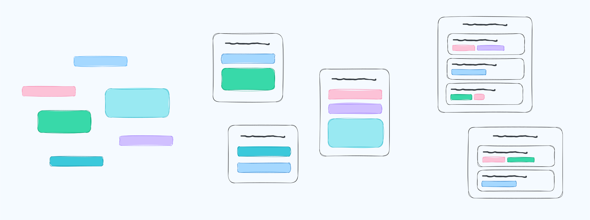

---

<b>⚠️ Under Active Development ⚠️</b>

This app is early in development and not yet ready for general use. 
Dont trust this app with any important data and expect bugs, missing docs, incomplete features etc!

---

# Headbase
The customizable database for your brain. Note-taking, task-management, personal knowledge bases and more.

## About
The way each person wants to organise content is unique, personal and often use-case specific. Headbase gives you the building blocks to create your own content databases, in your own way.  
It is not just a "notes app" or a "task management app", it is what you decide to build.  

Your content in Headbase is built using four building blocks:
- **Fields** are the core of your content, and range from basic types like text and numbers to more advanced types like media, scales and relationships.
- **Content items** are just groups of fields with a title, edited together.
- **Views** allow you to query your content items and display results using a list, kanban board, calendar, canvas and more.
- **Templates** allow you to create re-usable groups of fields. This is where you define your concept of a note, task, recipe, bookmark... anything you want.

If you want to learn more about how the Headbase content system works and see some examples, check out the **[content structure guide](./docs/content-structure.md)**.

### Cloud Features
Headbase is a local-first progressive web app, meaning it's designed to work on your device and doesn't need an internet connection after you download it for the first time.  
If you wish to enable features like cloud backups and cross-device synchronisation, you can do this by [self-hosting your own server](./docs/self-hosting.md).

## Project Structure
This is a monorepo containing all projects related to Headbase:
- `web` - The web app for using Headbase in a browser.
- `design` - Contains designs, wireframes etc

## Contributions
This project is open source, not open contribution.  
This is a personal project currently so while your more than welcome to try it out and raise bug reports and similar
I'm not interested in external code contributions or feature requests right now.

## License
All projects that are part of Headbase are released under the [GNU AGPLv3](https://choosealicense.com/licenses/agpl-3.0/) license.
