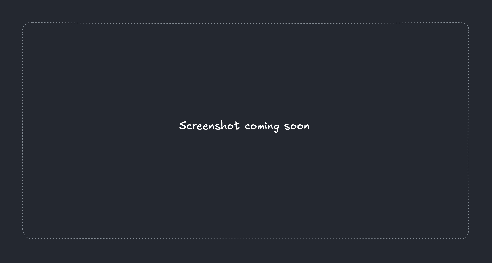

<h1 align="center">Headbase</h1>

<strong>Headbase</strong> turns your local files into a queryable database for your brain. Note taking, task management, knowledge bases and more.

  <a href="https://headbase.app">Web App</a> •
  <a href="/docs/user-guide">User Guide</a> •
  <a href="/docs/developer">Developer Documentation</a> •
  <a href="#">Feedback</a> •
  <a href="https://github.com/headbase-app/headbase/issues">Report Issue</a>

## About
> [!WARNING]
> This app is in active development and not ready for everyday use. You're welcome to explore at your own risk, but expect bugs, missing docs, incomplete features etc!

Headbase is a lot of different things...
- **A file editor** built around the concept of a "vault" where you read and write files to your device, and optionally sync that vault between devices.
- **A database** where you can query your files and display the results as a list, kanban board, calendar, canvas or graph.
- **An exploration** of [local-first software](https://www.inkandswitch.com/essay/local-first) and [malleable systems](https://malleable.systems). The goal isn't to create a "notes app" or a "task management" app, but to provide building blocks for users to adapt as they wish while retaining ownership of their data.

**For users:**
- [Getting started](docs/user-guide/getting-started/README.md)
- [User guide](docs/user-guide/README.md)
- [FAQs](docs/user-guide/FAQs.md)
- [Feedback](https://github.com/headbase-app/headbase/issues)
- [Report issue](https://github.com/headbase-app/headbase/issues)

**For nerds:**
- [Self-hosting](docs/developer/self-hosting/README.md)
- [Architecture](docs/developer/architecture/README.md)
- [Build a plugin](docs/developer/plugins/README.md)
- [Encryption specification](docs/developer/specs/encryption/v1.md)
- [Local development](docs/developer/setup/README.md)

## Contributions
This project is open source, not open contribution.  
This is a personal project in its early stages. You're welcome to try it out, ask questions, raise bug reports etc but
it wouldn't be practical to accept external code contributions or feature requests yet.

I'm open to this changing in the future once the project is more stable, collaboration is one of the great things about open source after all!

## Credits
Inspired by great tools such as [Obsidian](https://obsidian.md/), [Notion](https://www.notion.com/) and [Todoist](https://www.todoist.com/).

## License
Headbase is released under the [GNU AGPLv3](https://choosealicense.com/licenses/agpl-3.0/) license.  
