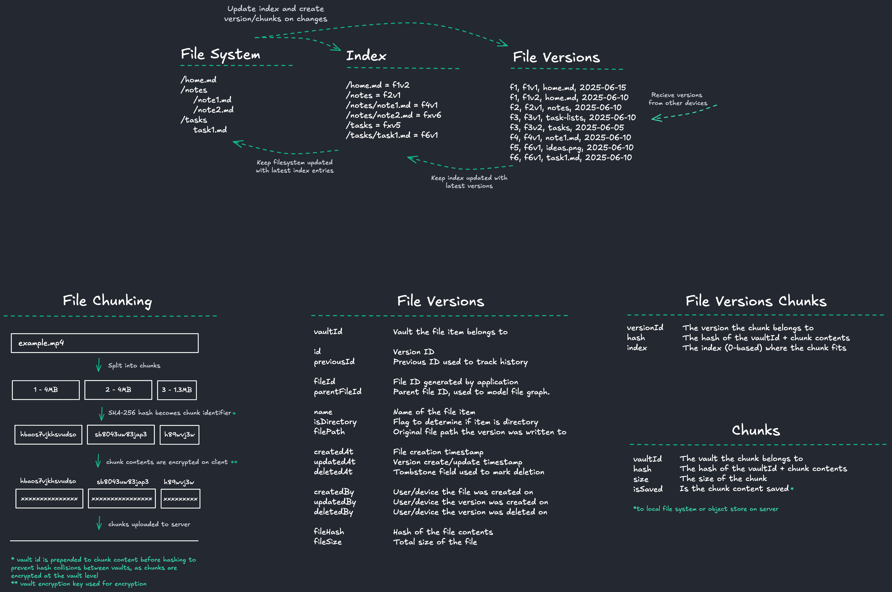

# Data Model

## Basics

- Device processing:
  - The index mirrors the filesystem and is how files and their snapshots are tracked.
  - Snapshots are stored in a graph structure using file ids and parent ids not paths, allowing moves/renames to be handled without causing child paths to become invalid.
  - When a file (or folder) is created it gets a unique file id and is added to the index and a snapshot is created.
  - When a file is updated, a snapshot is created and the index is updated.
  - When a file is deleted, it is removed from the index and all snapshots are updated with the deletedAt tombstone field set.
  - There should only ever be one active file id per file. When a file is created, the app checks for any snapshot with a matching name, parent id & no previous version and deletes all related snapshots first.
- Desktop
  - The application attempts to keep the index in sync with external changes.
- Synchronisation:
  - Snapshots can be synced between devices, and can be done without data loss or conflict due to each snapshot being immutable.
  - Multiple devices may create the same file/folder concurrently with different file ids. If this occurs, a last-write-wins
  approach is taken to pick the winer and the older file is deleted. It is still present in the path history if required.
  - Multiple devices may update a file/folder concurrently. A last-write-wins approach is taken to pick the latest version.
  - When snapshots are downloaded, the index (and filesystem) is updated using a last-write-wins approach.
- History:
  - File history is the file id based tracking of history, which tracks history across moves and renames. 
  - Path history is path based tracking of history based on the path snapshots were written to.

## Actions
issues
- how to handle two device created different file ids for the same file?
- will this handle all situations of renaming/deleting/moving files and folders

create file
- remove any existing path metadata and file versions?
- new file id
- new version
- add to metadata cache

update file
- load old path from metadata cache
- if path doesn't exist
    - create new file
- else
    - new version using existing file id
    - add/update new path in metadata cache
    - if old path != new path (file has moved)
    - remove old path from metadata cache

delete file
- load path from metadata cache
- delete all versions with the matching file id
- delete path from metadata cache
