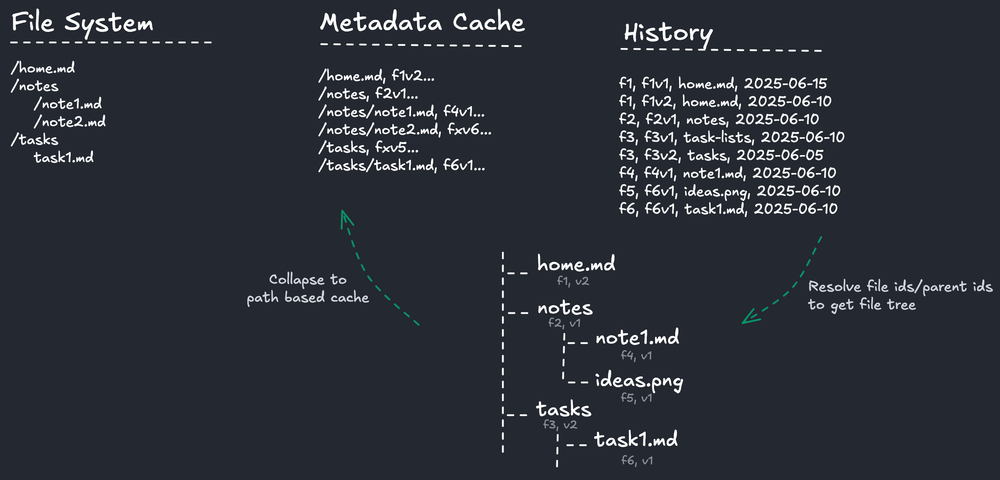

# Data Model

- The index mirrors the filesystem and is how files and thier versions are tracked.
- When a file (or folder) is created it gets a unique file id and is added to history and the index updated.
- When a file is updated, the change is written to history and mirrored in the index.
- The history is the ultimate source of truth. The index is a "snapshot" of what the filesystem should be given the history.
- A last-write-wins approach is taken to ensure that given the same history, all devices derive the same index & filesystem state.
- The index stores files in a graph using the file ids not paths, allowing it to handle moves/renames by updating one node.
- The history is synced between devices, and can be done without data loss or conflict due to each version being immutable.
- When updates are downloaded into history, the index (and filesystem) is updated using a last-write-wins approach.
- All data is preserved in history, so worse case scenario can be recovered directly from history
